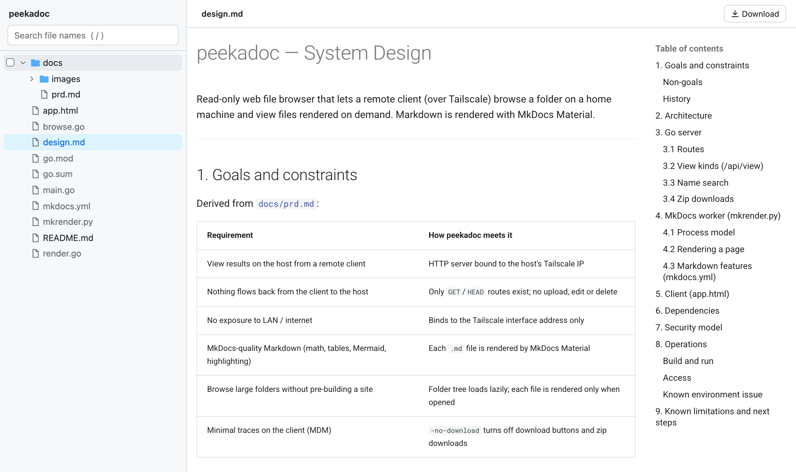

<div align="center">

# peekadoc

**Peek at your home machine's files from anywhere on your tailnet, without being able to change anything.**

[](https://github.com/huklee/peekadoc/actions/workflows/ci.yml)
[](go.mod)
[](https://squidfunk.github.io/mkdocs-material/)
[](https://tailscale.com/)

</div>

<picture>
  <source media="(prefers-color-scheme: dark)" srcset="docs/images/screenshot-dark.png">
  
</picture>

peekadoc is a read-only web file browser. A folder tree sits on the left, and the file you pick is rendered on the right when you open it: Markdown through [MkDocs Material](https://squidfunk.github.io/mkdocs-material/), HTML in a sandbox, code with syntax highlighting, and images and PDFs inline. It's built for one job: reviewing what's on your home machine (notes, reports, generated output) from a laptop or phone, with no way for files to flow back.

## Contents

- [Features](#features)
- [Quick start](#quick-start)
- [Usage](#usage)
- [Run it on your tailnet](#run-it-on-your-tailnet)
- [Run in the background](#run-in-the-background)
- [Run as a service (macOS)](#run-as-a-service-macos)
- [MkDocs setup](#mkdocs-setup)
- [Security](#security)
- [How it works](#how-it-works)
- [Development](#development)
- [Documentation](#documentation)
- [Roadmap](#roadmap)
- [License](#license)

## Features

- **Instant browsing of big folders**: the tree loads each folder when you open it, with file-name search (`/` to focus).
- **Real MkDocs output**: math, Mermaid diagrams, tables, admonitions, task lists, code highlighting and a table of contents, rendered per file in about 0.2 s and cached.
- **Previews for everything else**: sandboxed HTML pages, syntax-highlighted code and text, images, PDFs.
- **Live reload**: the view refreshes when the file changes on disk.
- **Downloads**: grab the current file, or multi-select files and folders (checkbox or ⌘/Ctrl-click) and get one zip. Turn it off with `-no-download`.
- **Read-only files**: browsing and download routes cannot change files; hidden files stay hidden and paths stay inside the served folder.
- **Nice to use**: deep links (`#/path/to/file.md`), back/forward, dark mode, phone-friendly layout, resizable sidebar.

## Quick start

**Requirements:** [Go](https://go.dev/dl/) 1.25+, [uv](https://docs.astral.sh/uv/getting-started/installation/), and Tailscale with [MagicDNS and HTTPS Certificates enabled](https://tailscale.com/docs/how-to/set-up-https-certificates). MkDocs is installed automatically; see [MkDocs setup](#mkdocs-setup).

```bash
git clone https://github.com/huklee/peekadoc.git
cd peekadoc
cp .env.example .env   # set PEEKADOC_ROOT to the folder you want to serve
./run.sh start
```

Open the HTTPS URL printed by the script and sign in. On first start, a random password is saved in `.cache/password`; read it with `cat .cache/password`. Set `PEEKADOC_PASSWORD` in `.env` to choose your own password, then restart. Sessions use a Secure, HttpOnly, SameSite=Strict browser-session cookie and end on sign-out or server restart. Browser session restore may keep the cookie after reopening, so sign out explicitly when finished.

> [!NOTE]
> Run `peekadoc` from the repository folder. It looks for `mkrender.py`, `mkdocs.yml` and `.cache/` relative to the working directory, so `go install` alone isn't enough.

## Usage

```text
./peekadoc [flags]
```

| Flag | Default | Description |
|---|---|---|
| `-root` | `.` | Folder to serve (read-only) |
| `-addr` | `127.0.0.1:8000` | Listen address. Use your Tailscale IP to expose it to your tailnet only |
| `-no-download` | `false` | View-only mode: hides download buttons and rejects downloads |
| `-mkdocs-config` | `mkdocs.yml` | MkDocs config used to render Markdown |
| `-renderer` | `mkrender.py` | MkDocs renderer script, run with `uv run` |
| `-cache` | `.cache` | Folder for the shared MkDocs theme assets |
| `-password-file` | `.cache/password` | Generated password file; `PEEKADOC_PASSWORD` overrides it |
| `-tls-name` | auto-detected | Full Tailscale DNS name for HTTPS |
| `-cert-dir` | `.cache/certs` | Cached Tailscale certificate and key |

**Keyboard:** `/` search · `Enter` open first result · `Esc` clear search or selection · ⌘/Ctrl-click select.

## Run it on your tailnet

1. Install [Tailscale](https://tailscale.com/download) on the host and viewing devices, and enable [MagicDNS and HTTPS Certificates](https://tailscale.com/docs/how-to/set-up-https-certificates) for the tailnet.
2. Run `./run.sh start`. The script binds to the current Tailscale IP and displays the full HTTPS URL, such as `https://machine-name.tailnet.ts.net:8000/`. Use that full name: Tailscale's public certificate does not cover the short host name or IP address.
3. Sign in with the password from `.cache/password` (or `PEEKADOC_PASSWORD`). All file previews, downloads, assets and APIs require the session.

The server requests a publicly trusted Tailscale certificate at startup and renews it before expiry. It will not serve HTTP if the HTTPS certificate is unavailable. Binding to the Tailscale IP keeps peekadoc off the LAN and public internet.

> [!TIP]
> On macOS, the App Store build of Tailscale can crash when its CLI is used from a terminal. See [troubleshooting](docs/troubleshooting.md#tailscale-on-macos) for the workaround.

## Run in the background

`run.sh` starts peekadoc as a detached background process. It runs in its own session, so it keeps going after you close the terminal or your SSH connection drops.

```bash
./run.sh start     # build if sources changed, start, wait until it answers
./run.sh status    # running? which pid and URL
./run.sh logs      # follow the log
./run.sh restart   # e.g. after editing mkdocs.yml or pulling changes
./run.sh stop      # graceful stop (also stops the MkDocs worker)
```

Settings come from a `.env` file next to the script (copy [`.env.example`](.env.example)) or from environment variables:

| Variable | Default | Description |
|---|---|---|
| `PEEKADOC_ROOT` | `$HOME` | Folder to serve |
| `PEEKADOC_ADDR` | `<tailscale-ip>:8000` | Listen address. When unset, the script uses your Tailscale IP and fails if Tailscale is unavailable |
| `PEEKADOC_PORT` | `8000` | Port used with the auto-detected address |
| `PEEKADOC_ARGS` | | Extra flags, e.g. `-no-download` |
| `PEEKADOC_PASSWORD` | generated | Override the password saved in `.cache/password` |
| `PEEKADOC_TLS_NAME` | auto-detected | Full Tailscale DNS name for HTTPS |

The pid, address, URL and log file live in `.cache/` (`peekadoc.pid`, `peekadoc.addr`, `peekadoc.url`, `peekadoc.log`). `run.sh` doesn't survive a reboot. For that, use launchd below.

## Run as a service (macOS)

To keep peekadoc running across reboots, use the launchd template in [`contrib/`](contrib/com.github.huklee.peekadoc.plist):

```bash
cp contrib/com.github.huklee.peekadoc.plist ~/Library/LaunchAgents/
# Edit the copy: replace /Users/YOU/... paths, the -root folder and the -addr IP.
# Make sure PATH includes the folder containing uv (check with `which uv`).
launchctl bootstrap gui/$(id -u) ~/Library/LaunchAgents/com.github.huklee.peekadoc.plist
```

Logs go to `/tmp/peekadoc.log`. To stop it: `launchctl bootout gui/$(id -u)/com.github.huklee.peekadoc`. Use either launchd or `run.sh`, not both, since they'd compete for the same port.

## MkDocs setup

You don't need to install MkDocs yourself. `mkrender.py` lists its Python dependencies in an inline script header ([PEP 723](https://peps.python.org/pep-0723/)):

```python
# dependencies = [
#     "mkdocs>=1.6,<2",
#     "mkdocs-material>=9.5",
#     "mdx-truly-sane-lists>=1.3",
# ]
```

When peekadoc starts, it runs `uv run --script mkrender.py`, and `uv` installs these into a cached, isolated environment. It won't touch your system Python or any project virtualenv. MkDocs is pinned below 2.0 because MkDocs 2.0 drops the plugin and theming systems that Material depends on.

### Pre-install and verify

```bash
# Install the renderer's dependencies ahead of time (e.g. before going offline)
uv sync --script mkrender.py

# Show the installed MkDocs / Material versions
uv tree --script mkrender.py --depth 1

# Render one file by hand: prints {"ready": true}, then {"html": "..."}
printf '{"path": "%s"}\n' "$PWD/docs/prd.md" \
  | uv run --quiet --script mkrender.py --config mkdocs.yml --assets .cache/theme
```

### Customize rendering

All Markdown and theme settings live in [`mkdocs.yml`](mkdocs.yml). Edit it and restart peekadoc to apply the changes.

- **Markdown extensions**: add or remove entries under `markdown_extensions`. Everything from Python-Markdown and [PyMdown Extensions](https://facelessuser.github.io/pymdown-extensions/) is available, since Material depends on PyMdown.
- **Theme**: change `theme.palette` (colors, light/dark schemes) or `theme.features`. See the [Material setup docs](https://squidfunk.github.io/mkdocs-material/setup/).
- **Extra packages**: if an extension needs a package that isn't installed, add it to the `dependencies` list at the top of `mkrender.py`. `uv` installs it on the next start.
- **Different config file**: `./peekadoc -mkdocs-config path/to/mkdocs.yml`.

Some settings are fixed by how peekadoc renders. It builds each file as a one-page site in a temporary folder, so `docs_dir`, `site_dir` and `nav` are ignored. Keep `plugins: []` (search and most plugins need the whole site) and `use_directory_urls: false`.

Nested lists are handled automatically. Python-Markdown expects 4-space indentation, while files written for GitHub often use 2 spaces. When a file has 2-space nested list items, peekadoc enables `mdx_truly_sane_lists` for that file only.

Something not rendering? See [troubleshooting](docs/troubleshooting.md#markdown-rendering-mkdocs).

## Security

peekadoc is designed so that the browser can look but never touch:

- **Read-only content**: file routes use `GET`/`HEAD`; only login and logout accept `POST`.
- **Sandboxed paths**: any path segment starting with `.` is rejected (this covers `..` and dotfiles), and every path is resolved through symlinks and must stay inside `-root`.
- **Sandboxed content**: HTML files run in an opaque-origin sandbox, so their scripts can't reach peekadoc's API. SVG and XML get no scripting at all, and every raw response sends `nosniff`.
- **No network socket for the renderer**: the MkDocs worker only talks to the Go server over stdin/stdout.

> [!IMPORTANT]
> peekadoc requires a password and an authenticated browser session. Bind it to your Tailscale IP (not `0.0.0.0`) and use [Tailscale ACLs](https://tailscale.com/kb/1018/acls) to limit which devices can connect. If your client machine must not keep copies of files (e.g. under MDM rules), run with `-no-download`.

The full threat model is in [docs/design.md § Security model](docs/design.md#7-security-model).

## How it works

```
browser ──HTTP over Tailscale──▶ peekadoc (Go)
                                   ├─ /api/*   tree, search, previews, stat
                                   ├─ /raw/*   file bytes, downloads, zip
                                   └─ /mk/*  ──stdin/stdout JSON──▶ mkrender.py (MkDocs Material, via uv)
```

The Go server handles the UI (embedded into the binary), the folder tree, previews and downloads. For Markdown, it keeps one long-lived Python worker running and asks it to build each page with MkDocs when you open it. Pages are cached until the file changes. Design details, the API and trade-offs are in [docs/design.md](docs/design.md).

## Development

```bash
go build -o peekadoc . && ./peekadoc -root .   # serve the repo itself
gofmt -l . && go vet ./...                      # what CI checks
```

| Path | What it is |
|---|---|
| `main.go` | Flags, routes, HTTP server, shutdown |
| `browse.go` | Path sandboxing, listing, previews, search, raw files, zip |
| `render.go` | MkDocs worker process: start, restart, request/response, cache |
| `app.html` | The whole web UI (vanilla JS), embedded with `go:embed`; rebuild after editing |
| `mkrender.py` | MkDocs Material worker (inline dependencies, run by `uv`) |
| `mkdocs.yml` | Theme and Markdown extensions used for every page |
| `run.sh`, `.env.example` | Background start/stop script and its settings template |
| `contrib/` | launchd service template |
| `docs/` | Design, requirements, troubleshooting, screenshots |

CI ([`.github/workflows/ci.yml`](.github/workflows/ci.yml)) runs `gofmt`, `go vet` and `go build`, plus a smoke test that renders `docs/prd.md` through the MkDocs worker.

Contributions are welcome. Please open an issue to discuss larger changes first, and keep pull requests focused.

## Documentation

- [docs/design.md](docs/design.md): architecture, API, rendering pipeline, security model
- [docs/troubleshooting.md](docs/troubleshooting.md): rendering, connection, Tailscale, service and download issues
- [docs/prd.md](docs/prd.md): the original requirements (in Korean)

## Roadmap

- Bundle CSS/JS locally so clients don't need internet access
- Full-text search
- Jupyter notebook previews

See [docs/design.md § Known limitations](docs/design.md#9-known-limitations-and-next-steps) for the full list.

## License

No license has been chosen yet. Until one is added, all rights are reserved by the author.
